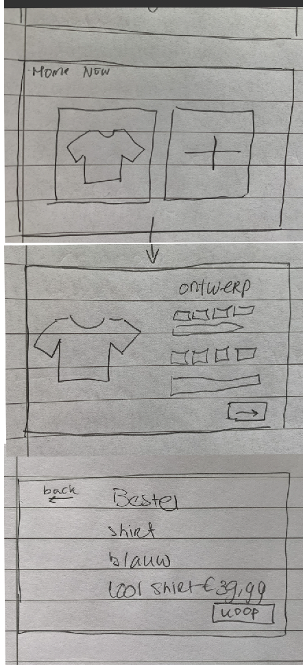

# Real-Time Web @cmda-minor-web · 2020/21

# Like link:
https://nerdy-tshirt-generator.herokuapp.com/shirt

## Table of Contents
- Beschrijving 
- Moscow
- Wireflow
- De 3 lagen
- Feature detection
- Used Packages
- Install project


### Beschrijving
Voor dit vak heb  ik gekozen om een nerdy tshirt generator te maken. De feature die ik gekozen heb om te gaan gebruiken is localstorage.
Bij dit project gaan we kijken naar experience, doormiddel van toegankelijkheid, progressive enhancements, 3 functie lagen en feature detection.
Probleem: Je wilt een nerdy t-shirt genereren, maar helaas is dit nu nog nergens mogelijk. Daarom gaan wij aan de slag om dit een werkelijkheid te maken. Het idee is dat je op deze site meerdere tshirts kan maken, terug zien en bestellen.
Oplossing: Met HTML, CSS en Javascript ben ik aan de slag gegaan om de nerdy tshirt droom waar te maken. Op mijn website kun je niet alleen shirts maken, je kunt ze ook nog eens stylen op wel 6 verschillende manier, wat oneindige mogelijkheden creërt voor je nerdy t-shirt.
Core functionaliteiten:
De hoofdfunctionaliteiten zijn het maken en stylen van het shirt. Doormiddel van kleur en tekst. Daarnaast wil je je shirt kunnen bestellen. En wil je natuurlijk je shirts terug kunnen vinden / opslaan om er later mee verder te gaan.


### Moscow
#### Must have:
- [x] Gegevens maker (naam, telefoon of email)
- [x] Kleur t-shirt
- [x] Tekst t-shirt
- [x] Maat t-shirt
- [x] M/V
- [x] Bestel pagina om een ontwerp kopen en laten maken

#### Should have:
- [x] Verder gaan waar je gebleven bent/ontwerp herzien
- [x] Validatie: alles moet zijn ingevuld. Geef duidelijke foutmeldingen
- [x] Gebruiker moet meerdere t-shirts kunnen maken en herzien, en moet dus een overzichtspagina hebben.
- [x] Styles
- [x] Enhancements

#### Could have:
- [ ] Zien hoe t shirt wordt als echt shirt met bijvoorbeeld een mockup.
- [ ] Ook zonder js bij bestelling kunnen zien wat het shirt is. (Had ik eerst met wel mongodb gedaan, maar was dat lokaal opgeslagen waardoor het niet kon worden laten zien op heroku deploy :(   .)

#### Would have:
- [ ] Meer style mogelijkheden (foto's etc.)


### Wireflow



### De 3 lagen

#### Functional/reliable layer:

Deze laag bevat de core functionaliteiten en moet op alle browsers bereikt kunnen worden. De reliable layer bevat alleen de html forms. De gebruiker kan het formulier invullen en aangeven hoe hij/zij het ontworpen shirt eruit wilt laten zien. Op deze laag kan de gebruiker dus het shirt ontwerpen via een formulier en bestellen. En dit is allemaal mogelijk alleen met html. 

#### Usable layer:

Deze laag verbeterd de gebruikerservaring, maakt het fijner voor de gebruiker om de website te gebruiken en voegt de styles toe aan de demo. Bij deze laag is het een stuk beter om naar het ontwerp te kijken. Door styling van het formulier en opfleuren van de webpagina ziet het er minder uit als een formulier, en is het voor de gebruiker fijner te gebruiken.

#### The pleasurable layer

Deze laag maakt de ervaring een geheel voor de gebruiker. Bij deze laag ziet de gebruiker wanneer hij/zij keuzes maakt over zijn/haar ontwerp meteen de veranderingen bij het shirt. Daarnaast maak ik gebruik van localStorage dus als de gebruiker even weggaat of de pagina refreshed of bijvoorbeeld een stap terug gaat is het formulier nog ingevuld en scheelt dit tijd voor de gebruiker.


### Feature detection
#### Progressive enhancements
Wanneer de javascript niet werkt of de gebruiker heeft dit zelf uitgezet dan werkt het live updaten niet, wanneer dit gebeurt word het shirt expres niet getoont aan de gebruiker en ervaart de gebruiker deze pleasurable laag niet. De gebruiker weet dan ook niet dat hij iets mist.

#### LocalStorage 
Het kan dus zijn dat een gebruiker cookies uit heeft staan dan werkt de localstorage niet. Voor localstorage heb ik de volgende code gebruikt om te testen of de gebruiker localStorage beschikbaar heeft: Dit stukje code heb ik gevonden via: https://stackoverflow.com/questions/16427636/check-if-localstorage-is-available: 
```
    function localStorageDetection(){
    const test = 'test';
    try {
        localStorage.setItem(test, test);
        localStorage.removeItem(test);
        return true;
    } catch(e) {
        return false;
    } 
}
```

Wat hierboven gebeurt is een test en gaat kijken of je iets kan toevoegen aan de localstorage zo ja, dan is de test True, als dat niet zo is en het failed dan geeft hij false terug en gaat er niks gebeuren. Dus als de try niet lukt gaat het script naar catch en geeft false aan. En in de if statement eronder geef ik dan aan is de localStorageDetection === true dan kan ik dingen in de localstorage plaatsen.

Het is fijn als de localstorage bij gebruiker werkt, omdat je dan later terug kan komen of als je per ongeluk refreshed is de data er nog steeds. Dus het is echt een enhancement. Staat het wel uit dan mist de gebruiker deze ervaring, maar dat is niet heel erg omdat het geen hele lange formulieren zijn en de gebruiker kan nog steeds ontwerpen en bestellen.

### Used Packages
- express
- mocha
- dotenv
- ejs
- nodemon

Install:
1. npm install
2. npm install (packages)
3. require: `const ... = require('...')`


### Install project
1. clone repo: 
``` 
https://github.com/Lottetekulve/browser-technologies-2021.git
```
2. Install used packages: 
```
npm install
```
3. Start op het web: 
```
npm run dev
```
4. Te vinden op: http://localhost:3001/


<!-- Add a nice image here at the end of the week, showing off your shiny frontend 📸 -->

<!-- ...but how does one use this project? What are its features 🤔 -->

<!-- This would be a good place for your data life cycle ♻️-->

<!-- How about a license here? 📜  -->